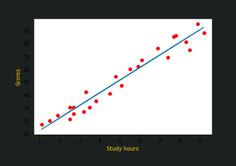
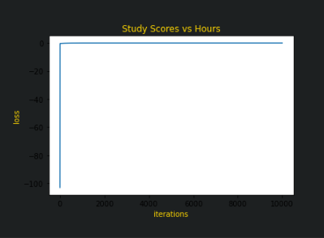

# Implementation of Linear Regression Using Gradient Descent
## AIM:
To write a program to implement the linear regression using gradient descent.
## Equipments Required:
1. Hardware – PCs
2. Anaconda – Python 3.7 Installation / Moodle-Code Runner
## Algorithm
1. Import all the necessary libraries.
2. Introduce the variables needed to execute the function.
3. Using for loop apply the concept using formulae.
4. End the program.
## Program:
```
Developed by: Sai Darshan G
RegisterNumber:  212221240047
import numpy as np
import pandas as pd
import matplotlib.pyplot as plt
data=pd.read_csv("student_scores - student_scores.csv")
data.head()
data.isnull().sum()
x=data.Hours
x.head()
y=data.Scores
y.head()
n=len(x)
m=0
c=0
L=0.01
loss=[]
for i in range(10000):
    ypred=m*x+c
    MSE=(1/n)*sum((ypred-y)*2)
    dm=(2/n)*sum(x*(ypred-y))
    dc=(2/n)*sum(ypred-y)
    c=c-L*dc
    m=m-L*dm
    loss.append(MSE)
print(m,c)
y_pred=m*x+c
plt.scatter(x,y,color="red")
plt.plot(x,y_pred)
plt.xlabel("Study hours")
plt.ylabel("Scores")
plt.title("Study Scores vs Hours")
plt.plot(loss)
plt.xlabel("iterations")
plt.ylabel("loss")
```
## Output:


## Result:
Thus the program to implement the linear regression using gradient descent is written and verified using python programming.
